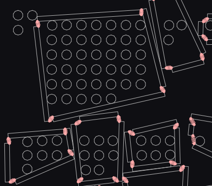
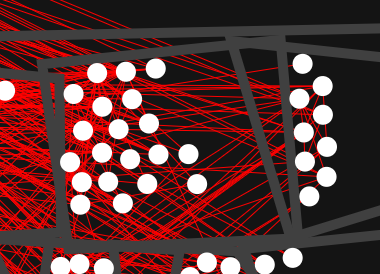

# Directory Visualization

This is an experiment to visualize files (circles) and directories (bounding boxes).

* related files will attract
* unrelated files will repel
* bounding boxes will contort to contain their files

## Problem (Oct 15, 2023)

Microservices came to fashion because of pain caused by the complexity monolithic style. I contend those pains were caused by poor modularity; organizing code by technology (dao, mapping, services, etc.) instead of by function (employees, payments, products).  The modular monolith can provide the simplicity of microservices, if it is organized correctly.

## Hypothetical Solution

Visualizing the dependency graph of a code project will help justify moving files to a business centric directory structure.  Plus it will show the particularly knotty parts of the code.

## Attempt 1: matter.js (Oct 18, 2023)

This did not go well.  The effect I desire does not work well with a physics engine like matter.js.  Some things that went wrong are:

* fast moving objects may jump out of their container
* additional code required to resize objects (edges of directory)
* quadrilaterals can bend to let the files escape through corners
* must be careful with force feedback: Energy gets added to the system, making it unstable
* matter.js "Constraints" can not be used to simulate attractive forces

## Attempt 2: p5.js (Nov 18, 2023)

The second attempt was spread over the past month as I battle the disillusionment of how tedious this is going to be.  ChatGPT helped a lot.

* p5.js has a very simple interface, so it is easy to start
* p5.js is only for drawing, all the constraints and rules must be written by me
* to minimize the "step-size" problem, all velocities were capped.  Still a problem, but less so.
* collision code is complicated AND error-prone: once an object "steps" through an edge it is free to run away entirely
* To get around the step-size problem, all edges are now "soft": Much like machine learning s-curves, all edges act on all objects no matter the distance; albeit with tiny forces far from the actual edges.
* Quadrilaterals apply containment forces to all object they contain, and expulsion forces on all objects excluded, to ensure objects are forced back should they step out of bounds.
* Simulating quadrilaterals as just four points is not enough to keep their volumes form overlapping are still over

## Usage

This includes a python program to extract dependencies from a python project.  It will output a json file that can be used by the visualization.

Example

    c:\Python311\Scripts\pydeps.exe ../django/django/ -v --noshow --deps-output dependencies.json
